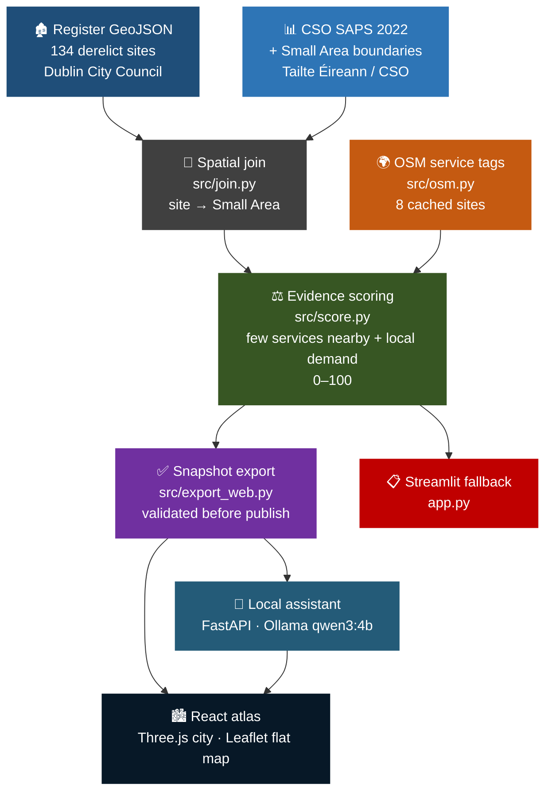
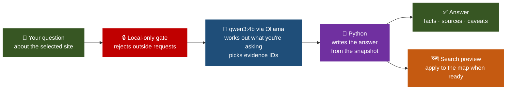

<div align="center">

# Second Life

**What could a derelict Dublin site become? A local evidence atlas for the people asking.**

[](https://python.org)
[](https://react.dev)
[](https://threejs.org)
[](https://vite.dev)
[](https://leafletjs.com)
[](https://fastapi.tiangolo.com)
[](https://ollama.com)
[](https://streamlit.io)

<br/>

*Good places deserve another chapter. · Dublin City Council register · CSO Census 2022 · OpenStreetMap · Offline React atlas · Local-only AI*

</div>

---

## 📖 What This Project Is

Dublin City Council publishes a register of derelict sites. There are 134 of them. Each row gives you an address, a date and a few yes/no flags, and that's about it. If a residents' group wants to argue that the empty house on their street should become a crèche, the register can't tell them how many kids live nearby or whether there's already a crèche around the corner.

Second Life fills that gap. For every site it pulls in two kinds of local evidence:

- 👥 **Who lives there**, from the 2022 Census. The CSO splits Ireland into *Small Areas*, its smallest census unit, usually a couple of hundred people. Each site is matched to the Small Area it sits in.
- 📍 **What's already nearby**, from OpenStreetMap (OSM), the open, volunteer-built world map. I counted relevant services, such as crèches, libraries and community centres, within 800 m of the site.

From those two it scores four possible uses: childcare, study space, a repair workshop, and a community hub. You go through one site at a time: the place, its possible uses, the evidence behind them, and what still needs checking. The full register stays searchable.

The scores are a starting point for a conversation. They can't tell you whether a building is sound, who owns it, or whether planning would allow a change of use, so every site ends with those questions written out. When I didn't have evidence for a site, the app says so and leaves it unscored.

### 🔭 At a glance

| | |
|:---|:---|
| 💡 **In one line** | A Dublin derelict-sites atlas that puts census and nearby-service evidence next to each site, scores four reuse ideas, and lists what still needs checking. |
| ❓ **The problem** | The register has 134 sites and almost no context, so you can't tell who lives nearby or what services already exist. |
| 👥 **Who it's for** | Residents' groups, town teams and councillors who want to talk about a specific site with more than a hunch. |
| 🧩 **The idea** | Compare demand (who lives there) with supply (what's already nearby), show the sums, and give the unknowns the same space as the scores. |
| 🛠️ **What I built** | A Python data pipeline, a validated data snapshot, an offline React/Three.js/Leaflet atlas, a local-only AI assistant, and a Streamlit fallback. |

---

## 🖥️ Product Surfaces

- 🏙️ **Offline React atlas** (`web/`). The main product. Desktop opens on a 3D model of Dublin; phones get a flat map. Every site has its own link (`?site=DS1596`), so you can send someone straight to one. Maps, fonts, census figures and scores all ship with the build, so it makes no calls to the internet.
- 🤖 **Local assistant** (`src/assistant_api.py`). An optional "Ask about this place" panel. It runs a small AI model on your own computer and can explain a site, compare two uses, or find sites from a plain-English request like "council-owned places with lots of under-15s".
- 📋 **Streamlit fallback** (`app.py`). A simpler single-file version for machines without Node.js.

---

## 🗃️ Data Sources

<div align="center">

| Source | What it gives | Licence |
|:---|:---|:---|
| 🏛️ **Dublin City Council** | [Derelict Sites Register](https://data.smartdublin.ie/dataset/derelict-site-register) on Smart Dublin: 134 sites, GeoJSON | [CC BY](http://www.opendefinition.org/licenses/cc-by) |
| 📊 **CSO Ireland** | [Census 2022 Small Area Population Statistics](https://www.cso.ie/en/census/census2022/census2022smallareapopulationstatistics/): population, age shares, households | [CC BY 4.0](https://www.cso.ie/en/aboutus/whoweare/copyrightpolicy/) |
| 🗺️ **Tailte Éireann / CSO** | [Small Area Boundaries 2022, generalised 20 m](https://data-osi.opendata.arcgis.com/datasets/osi::cso-small-areas-national-statistical-boundaries-2022-generalised-20m/about): the 2,261 area outlines on the map | [CC BY 4.0](https://creativecommons.org/licenses/by/4.0) |
| 🌍 **OpenStreetMap** | Nearby amenities within 800 m (straight line) | [ODbL](https://www.openstreetmap.org/copyright) · © OpenStreetMap contributors |

</div>

All four were retrieved on 4 October 2026. The register is the Smart Dublin release last updated on 24 June 2026. All 134 sites matched to exactly one Small Area, and none is missing census figures.

### ❔ Why only 8 sites have service evidence

The usual OSM query service (Overpass) was blocked while I built the dataset. The fallback is slow and rate-limited, so I cached a spread of eight sites across the city: `DS040`, `DS864`, `DS905`, `DS1012`, `DS1369`, `DS1596`, `DS1868` and `DS1982`. The other 126 sites still show their register and census facts. Their scores are left blank, because a guess would be worse than nothing.

---

## 🧠 Pipeline Architecture



The export step won't publish bad data. Before it replaces anything in `web/public/data/`, it checks for 134 unique sites, exactly eight scored, four uses each, scores between 0 and 100, and valid coordinates, sources and map shapes. If any check fails, the previous snapshot stays live and the reason is written to `data/cache/export_build_report.json`.

---

## ⚖️ Scoring Method

Every score runs from 0 to 100. A site scores high for a use when **lots of the relevant people live in its Small Area** and **there are few matching services within 800 m**. Half of every score comes from the "few services nearby" side.

<div align="center">

| Use | Nearby services counted (OSM tags) | Who it's for (Census) |
|:---|:---|:---|
| 👶 **Childcare** | `50%` · `kindergarten`, `childcare` | `50%` · share of people aged 0–14 |
| 📚 **Study space** | `50%` · `library`, `community_centre`, `coworking_space`, `office=coworking` | `50%` · share aged 15–24 |
| 🔧 **Repair workshop** | `50%` · repair crafts and shops, `second_hand`, `charity`, `recycling` | `25%` · population density · `25%` · households |
| 🤝 **Community hub** | `50%` · `community_centre`, `social_centre`, `arts_centre`, `place_of_worship` | `50%` · total population |

</div>

📏 **How to read a score.** Each ingredient is rescaled so the lowest site gets 0 and the highest gets 1 (min–max scaling), then the weights above are applied. Census values are compared across all 134 sites, but service counts only across the eight sites with OSM data. So a score tells you how a site compares with the other seven, not with the whole city, and adding a ninth site would shift every score.

### 📊 Scores for the eight sites with evidence

<div align="center">

| Site | Place | 👶 Childcare | 📚 Study | 🔧 Repair | 🤝 Hub |
|:---|:---|:---:|:---:|:---:|:---:|
| `DS905` | Naas Road Old, Coolfan House, Dublin 12 | **70.1** | 58.8 | 61.6 | 63.7 |
| `DS1868` | Mellowes Road, Finglas, Dublin 11 | 55.0 | 37.8 | **65.8** | 55.8 |
| `DS1012` | Rathmore Park, Raheny, Dublin 5 | **64.4** | 33.3 | 64.3 | 51.3 |
| `DS1982` | Coolgariff Road, Beaumont, Dublin 9 | 49.5 | 36.2 | **61.5** | 42.7 |
| `DS1596` | Shelmalier Road, East Wall, Dublin 3 | **60.7** | 14.4 | 17.0 | 35.6 |
| `DS040` | Conyngham Road, Dublin 8 | 47.4 | 38.0 | **57.3** | 41.5 |
| `DS864` | Templemore Avenue | 7.5 | 6.8 | **54.9** | 7.2 |
| `DS1369` | Merrion Road, former Swiftcall building | 50.7 | 31.4 | **52.6** | 47.7 |

</div>

The top use for each site is in bold. Study space doesn't come first anywhere, and Rathmore Park is basically a tie (64.4 vs 64.3).

<details>
<summary>🔍 Worked example: why childcare comes out on top at DS1596 (Shelmalier Road, East Wall)</summary>

```
Site: DS1596 · Shelmalier Road, 45, East Wall, Dublin 3
Small Area: 231 residents · 102 households · 6,530 residents/km²

Childcare        60.7
  OSM childcare: 0 within 400 m; 0 within 800 m
  Census share aged 0–14: 14.7%
  few-services score = 1.000   age-share score = 0.213
  → 100 × (0.5 × 1.000 + 0.5 × 0.213) = 60.7

Community hub    35.6
  OSM community: 2 within 400 m; 7 within 800 m; nearest 194 m
  few-services score = 0.545   population score = 0.166

Repair workshop  17.0
  OSM repair: 3 within 400 m; 22 within 800 m; nearest 376 m
  few-services score = 0.000   density = 0.141   households = 0.538

Study space      14.4
  OSM study: 1 within 400 m; 4 within 800 m; nearest 194 m
  few-services score = 0.200   age-share score = 0.088

Next checks:
  · What is the building's current condition?
  · What planning permission or change-of-use approval would be needed?
  · Who owns the site, and would they support a new use?
  · What heritage or conservation constraints apply?
```

> Almost all of that 60.7 comes from OSM showing no childcare within 800 m. East Wall's share of under-15s is near the bottom of the range. And OSM having no childcare tag nearby doesn't mean there's no crèche, so that's the first thing I'd check on the ground.
</details>

---

## 🤖 Local Evidence Assistant

The assistant answers questions about the site you're looking at. It's optional. If Ollama (the tool that runs the model) isn't running, the atlas works as normal and the panel explains how to set it up.



The model never writes facts. It does two small jobs: it works out what kind of question you asked (explain, compare, what's missing, facts, or search), and it picks from a fixed list of evidence IDs. Python then writes every sentence, number, source and date straight from the data. If the model names evidence that doesn't exist, the whole answer is thrown out. I set it up this way because a small model running on a laptop will make things up if you let it.

For searches, you see the filters it chose before anything changes. Click **Show on map** to apply them, or **Clear search** to go back to all 134 sites.

<div align="center">

| Limit | How it's enforced |
|:---|:---|
| 🚫 It can't state a fact or invent a score | It picks evidence IDs; Python writes the text from existing data |
| 📝 Ownership, planning and condition stay open | These come back as next checks, never answers |
| 🔒 Nothing leaves your computer | The model runs locally; outside callers and other websites get a 403 |
| 🔄 Answers match the data on screen | Each request carries the data version, and a mismatch is refused |
| 🙈 Questions aren't stored | Nothing is logged; the chat lives in the browser and clears when you switch sites or reload |

</div>

⏱️ Each answer has a 60-second time limit.

---

## 🧪 How I Checked It

The Python tests recompute scores for several sites and compare them with the published data, and make sure the exporter rejects duplicate IDs and out-of-range scores. The assistant tests try bad filters, fake citations, outside requests, out-of-date data, a stopped Ollama, and a browser that disconnects mid-answer.

I also wrote 24 questions meant to trip the assistant up: comparing a scored site with an unscored one, searches that should return nothing, "who owns this?", vague criteria, and attempts to make it ignore its instructions. None came back with a made-up number, score or source. The full answers are in `artifacts/assistant-evaluation.json`. Twenty-four questions can't cover everything, which is why the app always shows the filters it applied.

### ⚡ Speed on my laptop

16 GB of RAM, Intel Iris Xe graphics, model running entirely on the CPU (3.9 GB loaded).

<div align="center">

| Measurement | Time |
|:---|:---:|
| 🧊 First search, model just loaded | **50 s** |
| 🔥 Same search, model already warm | **4.7 s** |
| 📊 Typical answer during testing (median) | **13.7 s** |
| ↔️ Range during testing | **4.6 – 33.4 s** |

</div>

A faster machine will do better. Full notes are in [`artifacts/assistant-verification.md`](artifacts/assistant-verification.md).

---

## 🎨 Interface and 3D Atlas

On desktop the atlas opens on the whole city in 3D, or zooms straight to a site if you came from a link. On a phone it opens on the flat map. Both views can switch between city and site and show or hide the Small Area outlines, nearby services, and 400 m and 800 m rings. The 3D view only draws; all scoring happens in Python.

If WebGL fails or the 3D scene won't load, you drop to the flat map with your site still selected. If the map outlines fail too, the pins and search still work. The 3D view pauses when it's off screen and lowers its resolution on slow machines. Reduced-motion settings turn off camera movement and the opening animation.

The cutaway building is an illustration, not a picture of any site on the register.

---

## 📁 Project Structure

```
secondlife/
├── 📄 app.py                          Streamlit fallback
├── 📋 requirements.txt                Data pipeline + Streamlit dependencies
├── 📋 requirements-assistant.txt      Extra dependencies for the assistant
├── ⚙️ run-assistant.ps1               Windows launcher for the assistant
├── 📄 .env.example                    Optional OSM endpoint overrides
│
├── 📂 src/
│   ├── load.py                        File paths and raw-data loaders
│   ├── join.py                        Matches each site to its Small Area
│   ├── osm.py                         Fetches and groups OSM services
│   ├── score.py                       Four-use scoring and next-check questions
│   ├── summary.py                     Plain-text site summaries
│   ├── export_web.py                  Validates and publishes the data snapshot
│   ├── scene.py                       3D scene geometry
│   ├── export_hero.py                 Redraws the decorative Dublin SVGs
│   ├── assistant_core.py              Assistant schemas and read-only evidence tools
│   └── assistant_api.py               Local assistant server; also hosts the built site
│
├── 📂 web/                            React + TypeScript frontend
│   ├── src/ProductApp.tsx             Site journey and register search
│   ├── src/SceneCanvas.tsx            3D city
│   ├── src/AtlasMap.tsx               Flat map
│   ├── src/AssistantPanel.tsx         "Ask about this place" panel
│   ├── public/data/                   Published data snapshot
│   ├── tests/                         Frontend tests
│   └── verify.html                    Dev-only page for faking 3D failures
│
├── 📂 data/
│   ├── raw/                           Register, census and boundary files
│   └── cache/                         Joined data, 8 OSM caches, evidence CSV, build reports
│
├── 📂 tests/                          Data, scoring and assistant tests + 24-question evaluation
└── 📂 artifacts/                      Screenshots and verification notes
```

---

## 🛠️ Local Development

You'll need Python 3.11 or newer and Node.js. Ollama is only needed for the assistant. Run everything from the `secondlife/` folder.

```bash
pip install -r requirements.txt
```

### 🗺️ Run the atlas

```bash
python -m src.export_web
cd web
npm ci
npm run dev
```

Open the URL Vite prints, usually `http://127.0.0.1:5173`. After `npm ci` has run once, it works offline.

### 🤖 Run the atlas with the assistant

```bash
pip install -r requirements-assistant.txt
ollama pull qwen3:4b
cd web
npm ci
npm run build
cd ..
python -m src.assistant_api
```

Start Ollama first, then open `http://127.0.0.1:8765/`. On Windows, `./run-assistant.ps1` does the Python setup for you. You need internet once, to download the model. For frontend work with hot reload, run the assistant server and `npm run dev` in two terminals.

### 📋 Run the Streamlit fallback

```bash
streamlit run app.py
```

It opens on `http://localhost:8501`.

### 🔄 Rebuild the data

```bash
python -m src.join
python -m src.score
python -m src.export_web
```

These rebuild the site-to-census match, the scores (plus `data/cache/site_evidence.csv`, one row per site with gaps flagged), and the published snapshot with its `build_report.json`.

### 🧪 Run the tests

```bash
python -m unittest discover -s tests -v
cd web
npm test
npm run build
```

`python tests/evaluate_assistant.py` runs the 24-question check. It needs the assistant server and Ollama running.

### ➕ Adding more OSM evidence

To score more sites, fetch new `data/cache/osm_<site-id>.json` files with `src.osm` and note when you got them. Update the expected scored count in `src/export_web.py`, rebuild the data, read `build_report.json`, and run the tests. Expect the existing scores to change, since services are compared across whichever sites have OSM data.

---

## ⚠️ Limitations

1. 📏 **Distance isn't demand.** 800 m in a straight line is a rough stand-in. It isn't a walking route, and it doesn't show anyone wants the service.
2. 🧩 **OSM is patchy.** Some parts of Dublin are mapped in far more detail than others. A missing tag can push a score up when the service is really there.
3. 🔢 **Eight sites is a small group.** The services side of each score only compares those eight.
4. 🏘️ **Census figures describe the area, not the building.** The site might sit right at the edge of its Small Area.
5. 📸 **The register is a snapshot.** Sites may have been sold, fixed up or removed since.
6. 🧪 **Testing so far is limited.** The assistant has only run on one laptop, and I haven't tested with a touch device or screen reader yet.

<div align="center">

| 🔧 Possible extension | 📈 What it would add |
|:---|:---|
| 🌍 OSM evidence for all 134 sites | A citywide comparison instead of eight sites |
| 🚶 Walking-route distances | Real access instead of straight-line rings |
| 🏛️ Planning, ownership and condition records | Answers to the next checks |
| 🗣️ Input from people who live nearby | The local knowledge no dataset has |
| ♿ Screen reader and touch testing | Proof it works for everyone who'd use it |

</div>

---

## 🏛️ Design References

Showing evidence gaps openly came from reading about [decision support for derelict buildings](https://isprs-annals.copernicus.org/articles/IV-4-W7/19/2018/) and [deliberative reuse planning](https://digitalcommons.lmu.edu/cate/vol6/iss1/11/). The [Government of Ireland Design System](https://github.com/ogcio/govie-ds) guided accessibility and typography (no official branding is used). The assistant's design drew on [Ollama structured outputs](https://docs.ollama.com/capabilities/structured-outputs), [ALCE citation evaluation](https://aclanthology.org/2023.emnlp-main.398.pdf), an [ACM survey on hallucination](https://doi.org/10.1145/3703155), and Microsoft's [guidelines for human–AI interaction](https://www.microsoft.com/en-us/research/publication/guidelines-for-human-ai-interaction/).

None of these say anything about whether my scoring model is right.

---

## 👤 Author

**Abinash Prasana Selvanathan**

*Built for OpenAI × Give(a)Go × Dogpatch Labs. If it's useful to you, a ⭐ is appreciated.*
